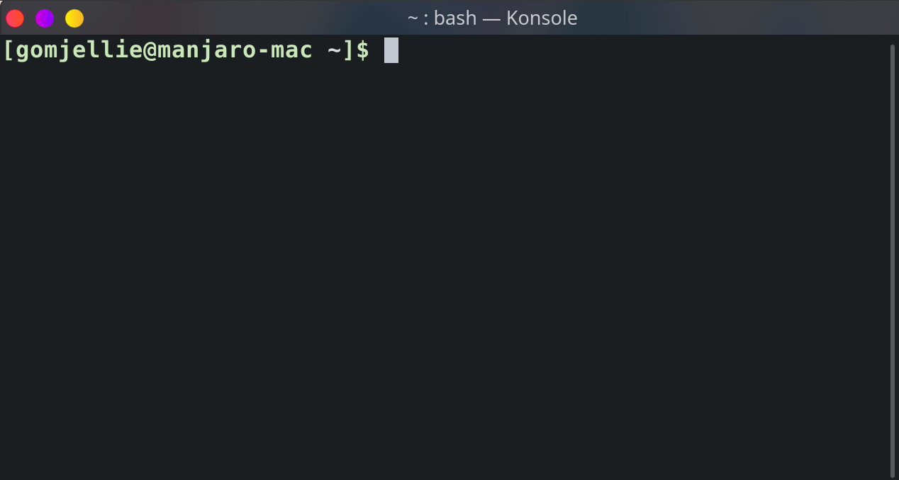

# bash-hangul
쉘에 입력하는 한글을 영어로 바꿔줍니다. ex) !ㅎ->!g, ㅣㄴ->ls

[zsh-hangul](https://github.com/gomjellie/zsh-hangul) 의 Bash버전 입니다.



zsh 버전에서 동작하는 많은 기능이 아직 구현되지 않았습니다.

입력하는 모든 한글이 전부 bash에서 영어로 변환되서 입력이 됩니다.

한글입력이 아예 불가능합니다.

# INSTALLATION

## 코드를 클론합니다.

```sh
git clone https://github.com/gomjellie/bash-hangul ~/bash-hangul
```

## ~/.bashrc 의 뒤에 bash-hangul 을 로드하는 코드를 추가해줍니다.


```sh

echo "source ~/bash-hangul/bash-hangul.plugin.sh" >> ~/.bashrc

```

## load ~/.bashrc

```sh
source ~/.bashrc
```
